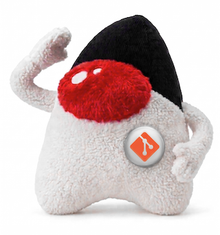

[](https://jitpack.io/#umjammer/vavi-apps-gitup)
[](https://github.com/umjammer/vavi-apps-gitup/actions/workflows/maven.yml)
[](https://github.com/umjammer/vavi-apps-gitup/actions/workflows/codeql.yml)


# vavi-apps-gitup



SourceTree-like git GUI (Swing) using [GitUp](https://gitup.co)'s `GitUpKit.framework` as the engine through JNA.

requires macOS and GitUp.app (tested with 1.4.0, embedding libgit2 1.4.4).

## Install

### maven

 * [maven](https://jitpack.io/#umjammer/vavi-apps-gitup)

### Build VaviGitUp.app

on macOS `mvn package` also makes `target/VaviGitUp/VaviGitUp.app` (the `release` profile, same as
[vavi-apps-hub](https://github.com/umjammer/vavi-apps-hub)).

```shell
$ mvn package -DskipTests
$ open target/VaviGitUp/VaviGitUp.app
$ open -a target/VaviGitUp/VaviGitUp.app --args /path/to/repository
```

## Usage

### Details

 - [Details](src/main/java/vavi/apps/gitup/readme.md)

### by maven

```shell
$ mvn package
$ mvn exec:exec -Drepo=/path/to/repository
```

## References

 * https://github.com/git-up/GitUp
 * https://libgit2.org/libgit2/#v1.4.4

## TODO

 - app icon

---

<sub>image designed by @umjammer, drawn by nano banana</sub>
